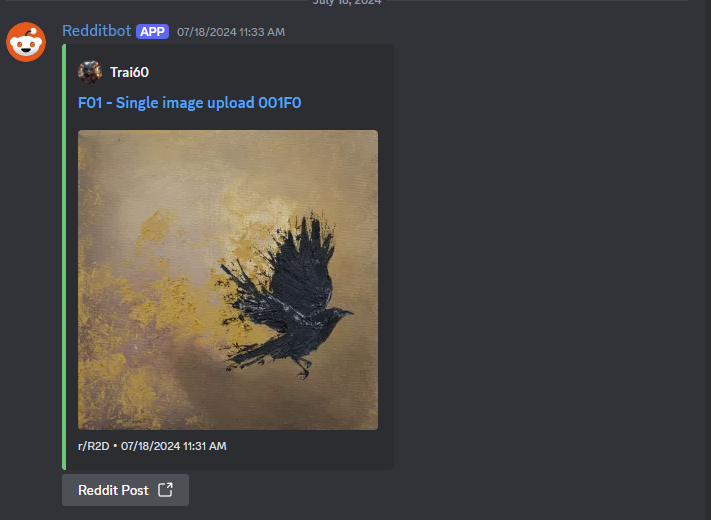
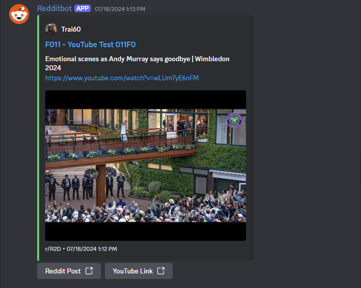
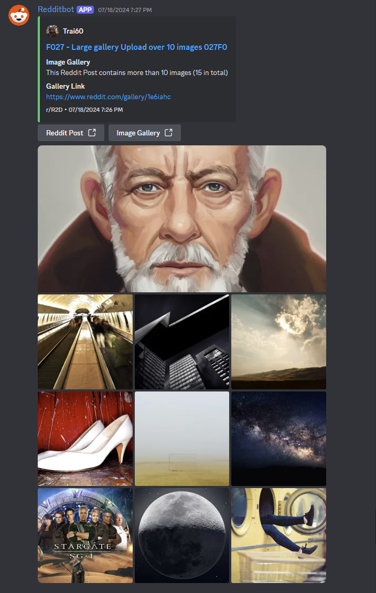

# R2D: Reddit to Discord Bot

R2D is a simple Discord bot that posts messages from Reddit to Discord. This project was born out of necessity and a touch of DIY spirit!

## Why R2D?

I was searching for a Discord bot that could post Reddit content, but many larger bots now put this feature behind a paywall. 
After stumbling upon [nynu_'s bot](https://discord.com/applicationdirectory/1049362593921368165), which is great but doesn't currently offer self-hosting, I decided to create my very first Discord bot. (Please be gentle - we all start somewhere!)

## Features

- Checks for new Reddit posts every 2 minutes (configurable)
- Posts Reddit content to specified Discord channels
- Supports multiple subreddit subscriptions
- Customizable message formatting
- Image Carousel for image galleries and other types of multiple image uploads

## Prerequisites

Before diving in, you'll need three key ingredients:

1. A server running Ubuntu 22.04 or above (tested up to 24.04). Don't worry, a basic VPS will do the trick!
2. A Reddit app (script type) - Whip one up [here](https://www.reddit.com/prefs/apps)
3. A Discord app - Create your own [here](https://discord.com/developers/applications)

## Server Installation

For detailed installation instructions, please refer to the `Ubuntu 24.04 Server Install Guide.md` file in this repository.

## Configuration

1. Edit the `.env_reddit` file with your Reddit and Discord credentials

## Setup

### Reddit App Setup

1. Create a Reddit app as a script
2. Use `http://localhost:8000` as the redirect URI if you're stuck
3. Jot down the app ID and Secret - you'll need these later!

### Discord App Setup

1. Create a Discord app and bot
2. Configure the following settings:
   - Under "Installation":
     - Authorization Methods: Select "Guild Install"
     - Install Link: Choose "Discord Provided Link"
     - Copy the bot invite URL link
   - Under "Bot":
     - Enable "Message Content Intent" in the "Privileged Gateway Intents" section
   - Set these bot permissions:
     - Read Messages/View Channels
     - Send Messages
     - Embed Links
     - Attach Files
     - Read Message History
3. Grab that Bot Token - it's crucial!

### Discord Server Setup

1. Invite your shiny new bot to your server using the bot invite URL you copied earlier
2. Make sure it has the right permissions (I usually create an "Apps" role for all my bots)
3. Ensure the bot has access to the channels where you want it to post
4. Choose which Roles or Discord Users have access to the slash commands of the bot

## Slash Command Usage

- subscribe (subreddit - channel)
- unsubscribe (subreddit - channel)
- list_subscriptions (will display your current subreddit subscriptions and in which channels)
- get_button_visibility (will show which buttons are currently being shown)
- set_button_visibility (allows you to turn off each button or turn off all buttons)

## What You'll See

Each Discord message from R2D includes:
- The Reddit user's name, avatar, and a link to their profile
- A direct link to the Reddit post in the title
- The subreddit name, post date, and time in the footer
- Reddit videos will download videos and embed a video upto 25mb Discord limits, once above the 25mb limit will fallback to posting a link to the video
- YouTube video posts adds a thumbnail of the video
- RedGIFs will download videos and embed a video upto 25mb Discord limits, once above the 25mb limit will fallback to posting a link to the video
- Various types of image carousel for image uploads to Reddit

## Current Limitations (aka "Room for Improvement")

R2D is a work in progress, and there are a few things it can't embed perfectly yet:

- YouTube videos (you'll see the title, video thumbnail and URL)
- Reddit videos (upload limit of 25mb Discord limit)
- External web links (displayed as simple links)
- Remove the ( Parentheses from the end of caption text
- Reddit Posts in Forums and Threads (exsisting and creating)
- Caption text not shown in the Discord message for Reddit Image Galleries
- Reddit crossposts

I'm hoping to tackle these in the future. If you're feeling adventurous and want to help out, I'd love the collaboration!

## Contributing

Got ideas? Found a bug? Want to make R2D even better? Contributions are more than welcome! Feel free to submit pull requests or open issues.

## Screenshots

Curious about how R2D looks in action? Here are some examples:

*A some typical subreddit posts as displayed by R2D*

*The slash command interface for R2D*

Check out the `Screenshots` folder for more examples! added new screenshots for updated version 1.2

## A Final Note

This is my first Discord bot, so it might not be perfect. But hey, we all start somewhere, right? I hope you find R2D useful, and remember - feedback is always appreciated!

## Want to the bot in action

You can checkout my Discord server [here](https://discord.gg/qTTzNWM9Wv)
